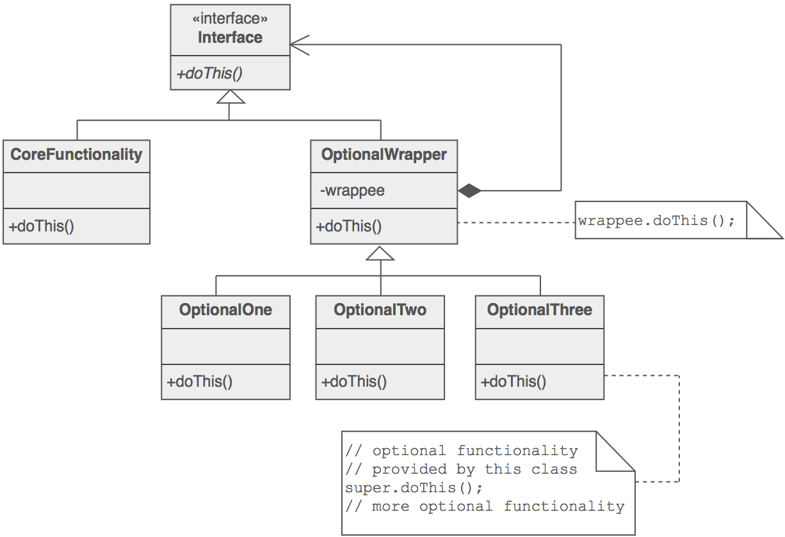
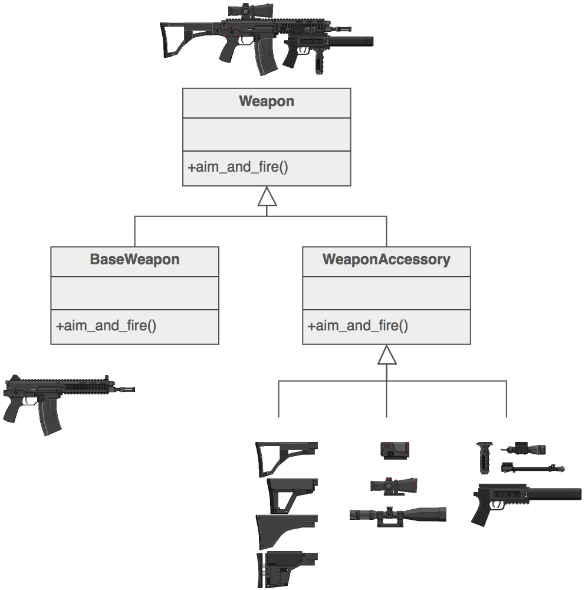

#Outline
####What will be in exams
+ Adapter
+ Decorator
+ Factory Method
+ Facade
+ Command
+ State
+ Strategy
+ Observer
+ Proxy
+ Singleton
+ MVC

####Things to know about patterns
+ situation to apply
+ motivation (forces) that motivate a particular type of solution

#Design Pattern
credit: [sourcemaking.com](https://sourcemaking.com/design_patterns)
###Creational Design patterns
+ Factory Method
+ Singleton

###Structural Design Pattern
+ Adapter
+ Decorator
+ Facade
+ Proxy

###Behavior Design Pattern
+ Command
+ Observer
+ State
+ Strategy

###MVC Java

#Creational Design patterns
##Factory Method
###Intent
###Problem
###Structure
###Example

##Singleton
###Intent
###Problem
###Structure
###Example

#Structural Design Pattern
##Adapter
###Intent
###Problem
###Structure
###Example

##Decorator
###Intent
+ เป็นการเพิ่ม responsibility ให้กับคลาสแบบ dynamically
+ เหมือนการเพิ่มเครื่องประดับ แต่เพิ่มแบบ recursive ทับของเดิมไปเรื่อย ๆ
+ สำหรับเรามันเหมือนการแต่งหน้าเค้ก ที่เพิ่ม topping เข้าไปได้เรื่อย ๆ

###Problem
+ เราต้องการเพิ่ม `behavior` หรือ `state` บางอย่างให้กับแต่ละ `objects` ระหว่าง run-time
+ แต่ `Inheritance` มันไม่เหมาะ เพราะมันเป็น `static` จะเพิ่มทีก็ต้องเขียนคลาสรอไว้ก่อน

 ยังไม่มีอธิบายตัวอย่าง

###Structure

####Example

##Facade

###Intent
###Problem
###Structure
###Example

##Proxy
###Intent
###Problem
###Structure
###Example

#Behavior Design Pattern
##Command
###Intent
###Problem
###Structure
###Example

##Observer
###Intent
###Problem
###Structure
###Example

##State
###Intent
###Problem
###Structure
###Example

##Strategy
###Intent
###Problem
###Structure
###Example
