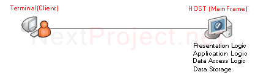
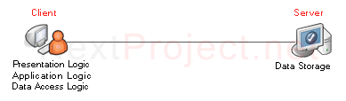
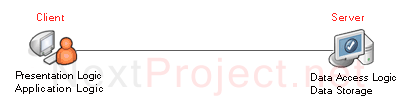
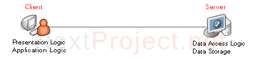
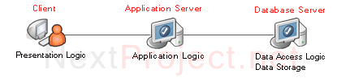
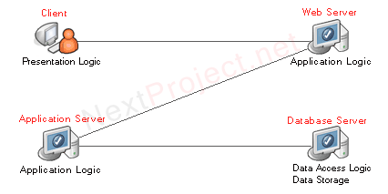

*คือก่อนจะเข้าใจเรื่อง Client-Server ขออธิบายเกี่ยวกับ Application Architecture ก่อน* 
*จะได้เข้าใจว่า Client-Server Architecture คืออะไร*

###Application Architecture
1. Host-based Architecture
2. Client-based Architecture
3. Client-Server Architecture

###1. Host-based Architecture
+ การทำงานหนักไปที่ host

####ข้อดี :
1. เมื่อเป็น Centralized control จะทำให้ง่ายต่อการ Code, Debug โปรแกรม

####ข้อเสีย :
1. เกิดคอขวดที่ Server เนื่องจากงานทั้งหมดถูกทำที่ Server ซึ่งจะส่งผลให้มี Performance จำกัด
2. Upgrade ยุ่งยาก และมีราคาแพง(Mainframe)

** สถาปัตยกรรมแบบนี้จะเรียกเครื่องแม่ข่ายว่า Host ซึ่งมีความหมายเดียวกันกับ คำว่า Server

###2. Client-based Architecture
+ การทำงานทุกอย่างจะอยู่ที่ Client
+ Server ทำหน้าที่เป็น Data Storage
+ แบบนี้ไม่ค่อยเป็นที่นิยม เนื่องจากคอขวดของระบบอยู่ที่เครือข่ายเพราะสถาปัตยกรรมแบบนี้ ใช้ Bandwidth ค่อนข้างสูง
+ ถ้าต้องการ Query ข้อมูลโดยก็ต้อง Load ตัวข้อมูลจริงผ่าน Network มาไว้ที่เครื่อง Client ทั้งก้อนเพื่อประมวลผล
+ ในการ update ก็เช่นกัน ต้องส่งข้อมูลทั้งก้อน ไปที่ Server

###3. Client-Server Architecture
+ การทำงานจะแบ่งกันทำ
+ โดยงานใดอยู่ใกล้ User ก็จะนำไปไว้ในฝั่ง Client
 + เช่น Presentation logic และ Application logic
+ ส่วนงานที่เกี่ยวข้องกับ Server จะนำไปไว้ในฝั่ง Server
 + เช่น Data storage และ Data access logic
+ ในการ Update ข้อมูล Application logic จะส่ง SQL ไปที่ Server เพื่อให้ Update record ให้ ดังนั้น Traffic จะน้อยกว่าแบบ Client-based

####ข้อดี :
1. Performance ดีกว่าแบบอื่น ๆ เนื่องจากกระจายงานกันทำ

####ข้อเสีย :
1. การพัฒนา SOFTWARE ยากกว่าเพราะต้อง Debug ข้าม Network
2. ในการแบ่งงานกันทำ บางครั้ง Application logic กับ Data access logic มาจากคนละยี่ห้อกัน จึงอาจไม่ Match กัน ทำให้ต้องมี Middleware เกิดขึ้น

##Middleware
+ เป็น software ตัวที่จะเป็นคนทำ **process management**
+ เป็นล่ามช่วยสื่อสารระหว่าง clients กับ servers
  + ที่เป็นล่ามเพราะบางที clients กับ servers มี platform ไม่เหมือนกัน
+ รับมือกับ messages มหาศาลจาก clients มากมาย
+ ส่วนใหญ่ middleware จะเป็นคอมพิวเตอร์ตัวนึงที่สละมาเพื่อเป็น middleware โดยเฉพาะ

###Two-Tier
+ Client
+ Server

###Three-Tier
+ Client
+ Server
+ middleware or Application Server

###N-Tier or Multi-Tier
+ Client
+ Server
+ Middleware, Application Server or more

