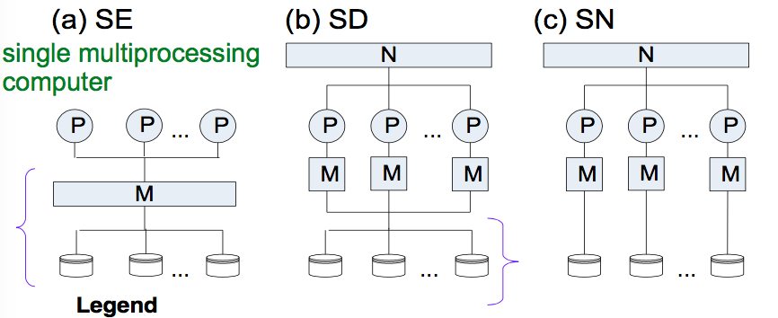

#####v.1.0.0

#Client-Server Processing, Parallel Database Processing and Distributed Databases
(ชื่อบท)

##Outline
+ Overview
+ Client-Server Database Architectures
+ Parallel Database Architectures
+ Architectures for Distributed Database Management Systems
+ Transparency for Distributed Database Processing
+ Distributed Database Processing

##Evolution of Distributed Processing and Distributed Data
+ Need to share resources across a network
 เดี๋ยวกลับมาเขียนอธิบาย

###1970s
+ Main frames
  + Timesharing
  + Centralized resources
+ First computer networks

###1980s
+ PCs and workstations
+ Local networks (LAN)

###1990s
+ Client-Server computing
  + request to server
  + server performs request and communicates result to client

####Timesharing

####Simple Resource Sharing

####Client-Server Processing

####Distributed Processing and Data

##Motivation
###For Client-Server Processing
+ Flexibility
  <ul>
  ในแง่ที่ว่า ง่ายต่อการ ดูแลรักษาและปรับให้เข้ากับระบบ
  </ul>
+ Scalability
  <ul>
  support เวลาเปลี่ยน hardware หรือ software (ที่ capacity มีผลกับระบบ)
  </ul>
+ Interoperability
  <ul>
  ก็คือการทำงานร่วมกัน สามารถเชื่อมระบบสองอันเข้าหากันได้ เพื่อที่จะได้ exchange data หรือใช้ software ร่วมกันได้
  </ul>

###For Parallel Database Processing
(Multiple Processors อาจมีคอมหลายเครื่อง and Multiple Discs)
+ Scale up
  <ul>
  เพิ่มปริมาณงานที่ทำให้เสร็จได้
  </ul>
+ Speed up
  <ul>
  เพิ่มความเร็วในการทำงานแต่ละ Task (ก็คือลดเวลาที่ใช้ในแต่ละ Task)
  </ul>
+ Availability 
  <ul>
  เพิ่ม accessibility (ความสามารถในการเข้าถึง) ให้ระบบ
  <li>High available: downtime(เวลาที่เครื่องไม่ทำงาน) น้อย</li>
  <li>Fault-tolerant: ไม่มี downtime
  </ul>

###For Distributed Data
+ Data Control 
  <ul>
  จัดตำแหน่ง data ให้ match กับ organization's structure
  </ul>
+ Communication costs 
  <ul>
  จำตำแหน่ง data ให้ใกล้เคียงกับ data usage เพื่อลด Communication cost (เวลาที่สิ้นเปลืองไประหว่างที่ communicate) และเพื่อ improve performance
  </ul>
+ Reliability 
  <ul>
  ทำให้ data พร้อมใช้งาน(ว่าง)บ่อย ๆ ก็เลยก้อป data ไปไว้หลาย ๆ ที่ (site)
  </ul>

###Summary of Distributed Processing and Data
| Technology | Advantages | Disadvantages |
| :------------- | :------------- | :------------- |
| Client-Server Processing | Flexibility, Scalability, Interoperability | High complexity, high development cost, possible interoperability problems |
| Parallel Database Processing | Scale up, Speed up, Availability, Scalability for predictive performance improvements | Possible interoperability problems, high cost |
| Distributed Databases | Local control of data, improved performance, reduced communication costs, increased reliability | High complexity, additional security concerns |

##Client-Server Database Architectures
+ แบ่งเป็นสองฝั่งคือ Client กับ Server โดยมี  Network เป็นตัวเชื่อม
+ เป็นระบบแบบ ส่ง messages (request for service) โดยส่งระหว่าง clients กับ servers

###Design Issues
+ **Division of processing** 
  แบ่ง tasks ไปที่ clients and servers
+ **Process management** 
  ทำงานร่วมกันระหว่าง clients กับ servers (ส่ง messages)
+ **Middleware** 
  software for process management

###Tasks to Distributed
ส่วนเลเยอร์ที่ต้องแบ่งกันทำ 
*(performed on client or remotely on a server)*
+ **Presentation**
  <ul>
  code to maintain graphical user interface
  </ul>
+ **Validation**
  <ul>
  code to ensure ว่า user inputs สอดคล้องกับ database
  </ul>
+ **Business logic**
  <ul>
  code to perform business function
  </ul>
+ **Workflow**
  <ul>
  code to ensure completion of business process
  </ul>
+ **Data Access**
  <ul>
  code to extract(สกัด) data to answer queries and modify database
  </ul>

###Middleware -> Interoperability
+ คือ software ตัวที่จะเป็นคนทำ **process management**
+ เป็นตัวกลางสื่อสารระหว่าง clients กับ servers แม้จะคนละ platform
+ รับมือกับ messages มหาศาลจาก **a large number of clients**
+ ส่วนใหญ่ middleware จะเป็นคอมพิวเตอร์ตัวนึงที่สละมาเพื่อเป็น middleware โดยเฉพาะ

ex. ODBC, JDBC

Middleware ช่วยให้ clients กับ servers ติดต่อกันได้แม้ไม่ได้ใช้ platform เดียวกัน

###Data Access Middleware
+ เป็นส่วนประสานงานระหว่าง relational กับ non relational data โดยใช้ SQL (ODBC,JDBC)
+ Requests to access data from a DBMS are sent to a data access driver rather than directly to the DBMS.
+ The data access driver converts the SQL statement into the SQL supported by the DBMS and then routes the request to the DBMS.
+ The data access driver adds another layer of overhead between an application and a DBMS.
 + However,the data access driver supports independence between an application and the proprietary SQL supported by a DBMS vendor.

####Two-Tier Architecture
มีสองฝั่งคือ Client กับ Server
+ Client เก็บ `user interface code`
+ Server เก็บ `data access logic`
+ Client กับ Server share `Validation` กับ  `Business logic` (ก็คือมีทั้งสองฝั่ง)

####Three-Tier Architecture
+ เพื่อเพิ่ม performance ก็เลยเพิ่ม Layer ขึ้นมาอีกตัวเป็นตัวไหนก็ได้จากสองตัวนี้
  + Middleware Server
  + Application Server
+ ส่วน additional server software อาจจะเก็บไว้ที่คอมเครื่องอื่นก็ได้ หรือจะกระจายอยู่ทั้ง Clients รือ Servers ก็ได้

####Multiplier Architecture
+ เพิ่มหลายตัวรวมเป็น
  + Client
  + Server
  + Middleware Server
  + Application Server
+ ทำให้ส่วนแบ่งของ processing ทำงาน flexible มากขึ้น
+ application จะเป็นคนทำส่วน business logic และ manage ข้อมูลพิเศษเช่น ไฟล์รูป

##Parallel DBMS
การจัดการฐานข้อมูลแบบขนาน
 *resources = processors, disks, and memory*
+ คือ DBMS ที่รันบน multiprocessor
+ วาง resources แบบ parallel กัน (วางได้หลายแบบ เดี๋ยวมีแบบบอกข้างล่าง)
+ แบ่งงานระหว่าง resources เพื่อให้ได้ performance ตามที่ต้องการ (scaleup, speedup and availability)
+ Uses high speed network, operating system, and storage system
+ Purchase decision involves more than parallel DBMS

###Basic Architecture
Resource
+ P: processor
+ M: memory
+ N: high-speed network
วาง resource แบบ:
+ SE: shared everything(คือหาไม่เจอ)
+ SD: shared disk
+ SN: shared nothing

###วางแบบ shared-everything(ในสไลด์มีตัวนี้แต่หาข้อมูลไม่เจอเลย)

###วางแบบ shared-memory

###วางแบบ shared-disk

###วางแบบ shared-nothing

##Distributed Database
คนใช้จะมองว่าเป็น single database คือมีระบบฐานข้อมูลอันเดียว
แต่จริง ๆ แล้วเป็นหลาย ๆ database เชื่อมต่อกันอยู่ข้างหลัง
###Distributed Database Architectures
+ **Component Architecture** manages distributed database requests.
+ **Schema Architecture** provides additional layers of data description (global, local).

####Global Requests:
*use data stored at more than one site*

###Component of a DDBMS

##Component of a DDBMS

##Distributed DBMS (DDBMS)
#####*ระบบการจัดการฐานข้อมูลแบบกระจาย*

###มุมมองทาง Logical
+ มี 1 ฐานข้อมูล (single logical database)
+ ซึ่งแบ่งออกเป็น `fragments` ต่าง ๆ
+ โดย `fragments` นั้นจะถูกจัดเก็บลงในคอมเครื่องเดียวหรือหลายเครื่องก็ได้
+ แต่อยู่ภายใต้การควบคุมของแต่ละ DBMS
+ คอมแต่ละตัวจะมีการเชื่อมต่อสื่อสารกันแบบเครือข่าย
+ ซึ่งแต่ละ site หรือสาขาก็สามารถประมวลผลเองได้โดยอิสระ
+ และ แต่ละ user สามารถเรียกใช้บริการให้ประมวลผลหรือจัดเก็บช้อมูลลงสาขาตัวเองหรือสาขาอื่น ๆ ที่อยู่ในเครือข่ายได้

###มุมมองทาง Physical
+ มีการจัดเก็บข้อมูลอยู่ในฐานข้อมูลที่กระจายกันอยู่
+ กระจายอยู่ใน**คอมหลายเครื่อง**และ**คอมอยู่คนละที่**
+ แต่สามารถเชื่อมโยงกันได้ผ่านระบบเครือข่าย

###การใช้งาน
User เข้าใช้ผ่าน Application
+ สามารถตั้งให้ใช้ได้แต่ local(ใช้ข้อมูลจากสาขาตัวเอง) หรือแบบ global(ใช้ข้อมูลจากสาขาอื่น) ได้

###Concept
+ สรุปแล้ว DDBMS คือ software ที่ช่วยให้ user มองผ่าน(Transparent)ความเป็นจริงที่ว่าระบบข้างหลังนั้นยุ่งยากแค่ไหน
+ เพื่อที่ user จะได้ใช้งานได้แม้ไม่รู้ว่าระบบด้านหลังจัดเก็บแบบไหน

###Component
+ แต่ละสาขา (site) ไม่จำเป็นต้องมี local database เป็นของตัวเอง
ตามรูป
รูป

##Summary
###Distributed Database
คือระบบที่กระจายฐานข้อมูลไปยังที่ต่าง ๆ และ เชื่อมต่อกันผ่านระบบเครือข่าย

###DDBMS
software ที่จัดการระบบฐานข้อมูล และอำนวยความสะดวกให้ user

###Fragments (ขี้เกียจอ่ะ เดี๋ยวกลับมาเขียน)

##Distributed Processing (คนละอันกับ DDBMS นะเฮ้ย)
#####*การประมวลผลแบบกระจาย*

###หัวข้อที่เหลือ
+ Distributed Query Processing
+ Distributed Transaction Processing
+ Distributed Concurrency Control
+ Primary Copy
 + Distributed copy of data item
+ Centralized Coordination
+ Distributed Recovery Management
+ Distributed Recovery Control
+ Distributed Transaction
+ Two-Phase Commit (2PC)

##Summary
+ Utilizing distributed processing and data can significantly improve DBMS services but at the cost of new design challenges.
+ Client-server architectures provide alternatives among cost, complexity, and benefit levels.
+ Parallel database processing provides improved performance (speedup and scaleup) and availability.
+ Architectures for distributed DBMSs differ in the integration of the local databases and level of data independence.

##Glossary
###Relational Database
ฐานข้อมูลเชิงสัมพันธ์ 
*ฐานข้อมูลแบบหนึ่งซึ่งประกอบด้วยตารางข้อมูลจำนวนมาก แต่ละตารางอาจใช้เก็บข้อมูลเกี่ยวกับเรื่องของคน สถานที่ เหตุการณ์ สิ่งต่างๆ หรือความสัมพันธ์ระหว่างเรื่องเหล่านี้ การเก็บข้อมูลเป็นตารางๆ นี้นอกจากมีลักษณะสอดคล้องกับการใช้งานข้อมูลในชีวิตประจำวันเช่น ตารางเดินรถไฟแล้ว ยังมีพื้นฐานหลัการมาจากคณิตศาสตร์ที่เรียกว่า ความสัมพันธ์ หรือ relations ด้วย*

.
